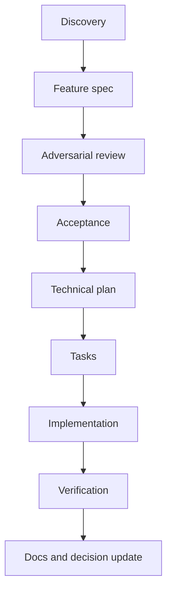

# Documentation and Decision Governance

## 1. Mục đích

Tài liệu này quy định cách tạo, duyệt, thay đổi và kiểm chứng nguồn sự thật. Mục tiêu là tránh ba lỗi của V1: tài liệu lệch code, nhiều ngưỡng cùng nghĩa và AI tự lấp câu hỏi mở.

## 2. Không dùng một hierarchy tuyến tính cho mọi loại quyết định

Nguồn có thẩm quyền được xác định theo **loại nội dung**, không theo một danh sách ưu tiên chung:

| Loại nội dung | Nguồn có thẩm quyền | Không được ghi đè bởi |
|---|---|---|
| Intended use, claim, non-goal | Product Constitution và Claims Matrix | Test, prototype, ADR, code cũ |
| Ranh giới safety | Clinical Boundary và Safety Gate catalogue | Feature convenience, model output |
| Hành vi người dùng | Feature spec đã duyệt | Test viết sai, chat cũ |
| Tiêu chí nghiệm thu | Acceptance của feature | Demo thủ công |
| Semantics/schema dữ liệu | Versioned data contract | UI naming, ORM model tạm thời |
| Privacy/consent/retention | Privacy và Data specs | Telemetry SDK, business request |
| Kiến trúc và dependency | ADR đã duyệt | Sở thích framework |
| Build/release/recovery | Runbook và CI thực thi | Prose lỗi thời |
| Cách agent làm việc | `AGENTS.md` | Prompt tùy hứng |

Nếu hai nguồn cùng loại mâu thuẫn, dừng implementation, tạo issue/decision record và chỉ tiếp tục sau khi owner chốt.

## 3. Metadata chuẩn

Mỗi tài liệu chuẩn tắc hoặc requirement quan trọng dùng các trường độc lập:

```yaml
decision_status: confirmed | proposed | tbd | deprecated
release_scope: m0 | m1 | m2 | m3 | m4 | m5 | post-mvp
review:
  product: approved | required | not-required
  clinical: approved | required | not-required
  privacy: approved | required | not-required
  security: approved | required | not-required
owner: role-or-name
last_reviewed: YYYY-MM-DD
```

Không ghép `CONFIRMED/PROPOSED`. `POST-MVP` không phải trạng thái quyết định. `EXPERT-REVIEW` không phải độ chín của requirement.

## 4. Từ khóa chuẩn

- **PHẢI / MUST**: bắt buộc và phải có ID nếu có thể kiểm thử.
- **KHÔNG ĐƯỢC / MUST NOT**: invariant hoặc hành vi cấm; phải có ID/test hoặc review gate.
- **NÊN / SHOULD**: mặc định áp dụng; ngoại lệ cần rationale trong PR/ADR.
- **CÓ THỂ / MAY**: tùy chọn, không được giả định là dependency.

Các từ mơ hồ như “đủ”, “nhanh”, “đáng kể”, “quan trọng”, “ổn định” chỉ được dùng trong overview. Feature spec phải định nghĩa chúng bằng enum, decision table, metric hoặc config có version.

## 5. Taxonomy ID

| Prefix | Loại |
|---|---|
| `FR-*` | Hành vi chức năng người dùng/hệ thống |
| `SAFE-*` | Ranh giới safety và escalation |
| `DATA-*` | Semantics, schema, retention, deletion |
| `PRIV-*` | Consent, purpose, access, disclosure |
| `SEC-*` | Security control |
| `NFR-*` | Performance, reliability, accessibility, offline |
| `REL-*` | Packaging, update, migration, recovery |
| `VAL-*` | Validation/benchmark |
| `AC-*` | Acceptance scenario |
| `D-*` | Product/technical decision |
| `ADR-*` | Architecture decision record |

ID không được tái sử dụng. Requirement bị bỏ phải chuyển `deprecated`, không đổi nghĩa dưới cùng ID.

## 6. Lifecycle



Feature chỉ `ready` khi problem, scope, definitions, flow, edge cases, privacy/data impact, acceptance, owner và open decisions đã rõ. `plan.md` phải dựa trên codebase thực tế; master spec không được dùng như technical plan.

## 7. Change control

| Thay đổi | Review bắt buộc |
|---|---|
| Claim/intended use/Safety Gate text | Product + clinical |
| Consent purpose, sharing, retention | Privacy + product |
| Encryption, key, updater, signing | Security + tech |
| Schema/algorithm semantics | Data/domain + migration owner |
| Module/API/event breaking change | Tech + ADR + migration |
| Ngưỡng camera/distance | Validation owner + benchmark evidence |

Mỗi thay đổi behavior phải cập nhật requirement, acceptance và traceability trong cùng một change set. Không sửa test để hợp code nếu spec chưa thay đổi có chủ đích.

## 8. Definition of Ready

- Decision status cho mọi lựa chọn ảnh hưởng behavior là `confirmed`.
- Các review bắt buộc đã `approved`.
- In/out of scope và failure modes rõ.
- Dữ liệu đầu vào/đầu ra, missing semantics và version rõ.
- Acceptance có happy path, denied/offline/unknown/error path.
- Không còn câu hỏi mở chặn feature.
- Technical plan đã kiểm tra codebase hiện tại.

## 9. Definition of Done

- Acceptance đạt trên release-like build phù hợp.
- Unit/integration/acceptance test liên quan qua.
- Lint, typecheck, build và architecture checks qua.
- Không mở rộng scope hoặc thêm dependency không có ADR/rationale.
- Error, restart, offline, permission denied và missing data được xử lý.
- Logging/telemetry không lộ dữ liệu cấm.
- Schema/API/docs/version cập nhật cùng behavior.
- Verification commands và giới hạn chưa xác minh được ghi rõ.

