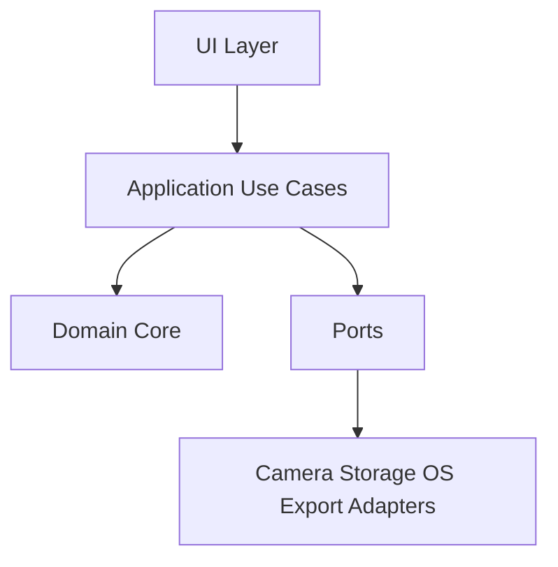

# Architecture Overview

```yaml
decision_status: confirmed
release_scope: m0+
owner: tech-lead
review: { security: required, privacy: required }
```

## Quyết định nền

V2 bắt đầu bằng **modular monolith + ports/adapters**. Một app, một release unit, một local database. Không microservice, plugin runtime hoặc event bus tổng quát ở MVP.



## Layer rules

### UI

- Render state và phát user intent.
- Không chứa scoring/safety/distance rule.
- Không gọi database/camera SDK trực tiếp.

### Application

- Điều phối use case, transaction, permission/consent và idempotency.
- Chuyển adapter output thành typed domain input.
- Không nhúng câu SQL hoặc DOM logic.

### Domain Core

- Pure TypeScript/Rust-compatible concepts tùy shell được chọn.
- Chứa state machine, policy, result semantics và invariant.
- Không import DOM, Electron/Tauri, MediaPipe, SQLite hoặc network client.

### Adapters

- Camera, landmark/model runtime, SQLite, file export, notification, key store và updater.
- Mapping external error thành error taxonomy.
- Không quyết định medical/safety/pattern semantics.

## Module boundaries đề xuất

```text
onboarding-consent
safety
symptom-checkup
measurement-quality
distance
work-session
baseline
patterns-visual-load
reports
user-data
platform
```

Mỗi module có public API hẹp, owner, invariants, data ownership, error modes và test. Consumer không import internal path của module khác.

## Interaction style

- Mặc định: gọi application use case đồng bộ/async trực tiếp.
- Domain event chỉ dùng cho fact đã xảy ra cần nhiều consumer, retry hoặc audit.
- Event immutable, versioned, consumer idempotent.
- Không tạo abstraction/dependency cho nhu cầu giả định.

## Shell decision

Electron/Tauri là `tbd` cho đến M0 POC. POC chấm theo camera stability, local assets, MSIX/Store, startup, RAM/CPU, accessibility, overlay/native needs, signing/update, CI reproducibility và chi phí migrate V1. Không đổi framework chỉ để “hiện đại”.

## Fitness functions

- Domain dependency boundary/cycle test.
- Public contract import test.
- Schema/event/config validation.
- Migration N-1/N-2 + recovery fixture.
- Privacy/logging forbidden-field scan.
- Camera-off/offline/unknown/delete acceptance regression.
- SBOM/license/vulnerability policy.

