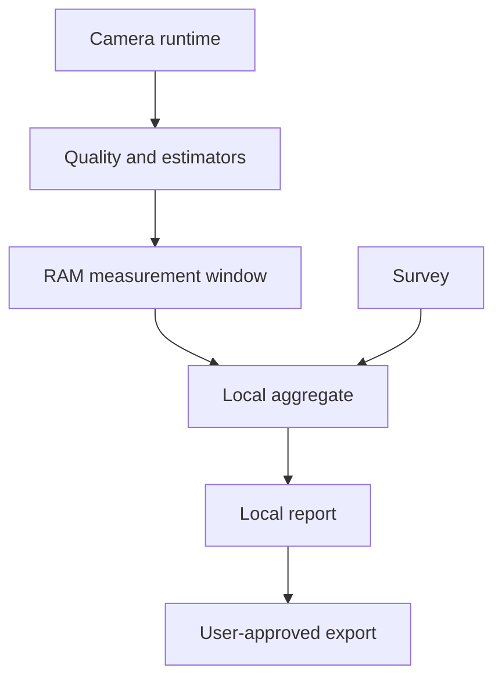

# Consent and Data Flow

```yaml
decision_status: proposed
owner: privacy-owner
review: { privacy: required, product: required, security: required }
```

## Purpose–data–consent matrix

| Purpose | Dữ liệu | Mặc định | Consent |
|---|---|---|---|
| Survey checkup | Câu trả lời, context | Local only | Hành động bắt đầu + privacy notice |
| Camera measurement | Runtime frames → aggregate | Tắt | Consent camera riêng |
| Local reports | Summary/derived results | Bật sau khi user lưu checkup | Nằm trong local processing notice |
| Diagnostics | Crash/technical logs đã scrub | Local; upload tắt | Opt-in trước upload |
| Product telemetry | Event kỹ thuật tối thiểu | Tắt ở MVP | Consent riêng, revocable |
| Export | User-selected fields | Theo yêu cầu | Preview + confirm mỗi export |
| Backup/share | Ciphertext/selected report | Post-MVP, tắt | Purpose-specific consent |
| Enterprise aggregate | Cohort aggregates | Post-MVP, không có trong personal MVP | Legal/privacy design riêng |

## Data flow cá nhân



Không có đường mặc định từ camera/survey tới cloud hoặc organization.

## Consent requirements

- `PRIV-CON-001`: Consent cụ thể theo purpose, không pre-checked và có thể rút.
- `PRIV-CON-002`: Camera permission của OS không thay thế consent sản phẩm.
- `PRIV-CON-003`: Consent record lưu purpose/scope/text version/time/status, không chỉ boolean.
- `PRIV-CON-004`: Rút consent dừng collection tương lai ngay; UI giải thích xử lý dữ liệu đã có.
- `PRIV-CON-005`: Purpose mới cần consent mới; không dùng “improve product” như mục đích bao trùm.
- `PRIV-CON-006`: Không phạt người dùng từ chối camera ngoài việc không có feature thật sự cần camera.
- `PRIV-CON-007`: Export/share luôn có preview; không tự gửi.

## Logging/telemetry allowlist

Mặc định chỉ được log: app version, OS/device class thô, feature state, error code, duration bucket, schema version. Không log raw answers, symptom text, frame, landmark, exact distance series, report content, secret hoặc filesystem path chứa tên người dùng.

Mọi event telemetry phải có owner, purpose, field allowlist, retention và removal date. Event ngoài allowlist bị CI/test chặn.

## Privacy UX

Privacy Center phải trả lời được:

- Camera có đang chạy không?
- Dữ liệu nào đang lưu và trong bao lâu?
- Feature nào tạo từng loại dữ liệu?
- Làm sao rút consent/reset calibration/reset baseline/xóa tất cả?
- Export nào đã tạo trong app và app có thể/không thể xóa gì?
- Có dữ liệu nào rời thiết bị không?

